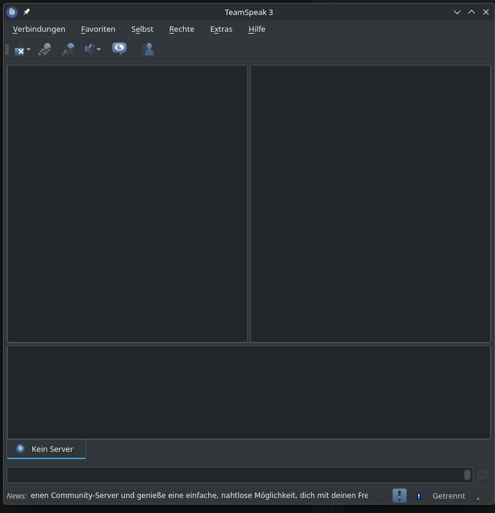

# TS3 Breeze Dark

A consistent **KDE Breeze Dark** theme for the TeamSpeak 3 client.



Unlike most TS3 dark themes, this one does not stop at the obvious widgets. It
also covers the three places where light remnants usually bleed through:

- **Chat log and info pane**, via a dedicated `Breeze_chat.qss`. Without that
  file TeamSpeak falls back to its light `default_chat.qss` — dark blue links
  and black text on a dark background.
- **Tree tooltips**, via reworked templates. The shipped templates are
  hard-wired to white on black.
- **The Qt palette**, via values TeamSpeak reads from a stylesheet comment. This
  also darkens what QSS cannot reach at all: links in the chat, natively drawn
  arrows, placeholder text, and the client state colors in the server tree
  (friend, blocked, recording, away, muted).

## Installation

### Linux

```bash
git clone <repo-url> ts3-breeze-dark
cd ts3-breeze-dark
./install.sh --icons
```

The script detects Flatpak and classic installations automatically.

### Windows

In PowerShell, inside the extracted folder:

```powershell
git clone <repo-url> ts3-breeze-dark
cd ts3-breeze-dark
.\install.ps1 -Icons
```

If PowerShell blocks execution, allow it for this session only:

```powershell
Set-ExecutionPolicy -Scope Process -ExecutionPolicy Bypass
```

With a **portable installation** the configuration lives in the program folder
instead of `%APPDATA%`. Pass the path in that case:

```powershell
.\install.ps1 -Icons -ConfigPath "D:\TeamSpeak3"
```

`-Icons` requires Python 3. Without Python the style still installs and only the
icon pack is skipped.

### Afterwards (all systems)

1. **Quit TeamSpeak completely and restart it** — palette values are only read
   at startup, switching the style in a running client is not enough.
2. Tools → Options → Design → **Style: Breeze**
3. With `--icons` / `-Icons`, additionally: Tools → Options → Design →
   **Icon pack: breeze_dark_mono**

### Manual installation

Copy these three things into the configuration folder:

```
styles/Breeze.qss
styles/Breeze_chat.qss
styles/Breeze/*.tpl
```

| System | Configuration folder |
|---|---|
| Windows | `%APPDATA%\TS3Client\` |
| Windows, portable | the installation's program folder |
| Linux, Flatpak | `~/.var/app/com.teamspeak.TeamSpeak3/.ts3client/` |
| Linux, classic | `~/.ts3client/` |
| macOS | `~/Library/Application Support/TeamSpeak 3/` |

On Windows the quickest way there is `Win`+`R` and entering
`%APPDATA%\TS3Client`.

Two naming rules the client has hard-wired:

- The folder under `styles/` must be named exactly like the `.qss` without its
  extension — templates are looked up in `styles/<StyleName>/`.
- The chat file must be named `<StyleName>_chat.qss`.

## Layout

| File | Purpose |
|---|---|
| `styles/Breeze.qss` | widgets, Qt palette, TeamSpeak-specific object names |
| `styles/Breeze_chat.qss` | chat log and info pane (HTML subset) |
| `styles/Breeze/*.tpl` | templates for the info pane and tree tooltips |
| `tools/build-iconpack.py` | builds an icon pack suitable for dark backgrounds |
| `install.sh` | installation on Linux and macOS |
| `install.ps1` | installation on Windows |

## Colors

| Role | Value |
|---|---|
| Window | `#31363b` |
| View / base | `#232629` |
| Alternate row | `#2a2e32` |
| Text | `#eff0f1` |
| Text dimmed | `#bdc3c7` |
| Disabled | `#7f8c8d` |
| Borders | `#4d5257`, `#76797c` |
| Accent / link | `#3daee9` |
| Positive | `#27ae60` |
| Neutral | `#f67400` |
| Negative | `#da4453` |

## Icon pack

TeamSpeak's `default_mono_2014` pack draws its glyphs in `#404547`. Against the
window background `#31363b` that is a contrast ratio close to 1:1 — the icons
show up as dark blobs. `tools/build-iconpack.py` reads the installed original,
recolors the SVGs and writes `breeze_dark_mono.zip`.

White is inverted along with everything else: in the original it serves as a
cut-out *on top of* the dark glyph, for example the X in the disconnect icon. If
it stayed white it would disappear into the now-light glyph.

The recolored graphics are **not** part of this repository — they are derivative
works of TeamSpeak's icon pack. The script builds them locally from your own
installation.

It finds the original by itself; if it does not, pass the path:

```bash
# Linux
python3 tools/build-iconpack.py --install

# Windows
python tools\build-iconpack.py --install
python tools\build-iconpack.py --install --source "C:\Program Files\TeamSpeak 3 Client\gfx\default_mono_2014.zip"
```

Without `--install` the zip ends up in the current folder and can be copied into
`gfx\` inside the configuration folder by hand.

## Notes on Qt 5

TeamSpeak 3 uses Qt 5. Two pitfalls that behave differently there than in Qt 6,
and that were expensive to track down while building this theme:

**Partially styled sub-controls turn black.** As soon as a widget is touched by a
stylesheet, Qt draws its sub-controls through the stylesheet. Every zone without
a defined fill color stays unpainted — and unpainted area is black. Affected,
among others:

- `QToolButton::menu-button` — Qt splits buttons that have a drop-down menu into
  a main area and a menu zone. If only `QToolButton` is styled, the menu zone
  shows up as a black bar.
- `QSlider::add-page` / `::sub-page` — both sides need a color, not just the
  filled one.
- `QScrollBar::add-page` / `::sub-page`, `QToolBar::handle`,
  `QToolBar::separator`.

**Hand-built CSS triangle arrows do not work.** The common pattern

```css
QComboBox::down-arrow {
    image: none;
    width: 0; height: 0;
    border-left: 4px solid transparent;
    border-right: 4px solid transparent;
    border-top: 5px solid #eff0f1;
}
```

renders the transparent borders as a black area under Qt 5. This theme therefore
avoids custom arrows entirely and leaves them to Qt — the palette set above makes
them light automatically.

If you add your own rules: the fastest way to diagnose a black area is to empty
the stylesheet temporarily and restart. In the light default theme you can
immediately see which element actually sits there.

## Palette values inside the stylesheet

TeamSpeak parses two patterns from the `.qss` — including from comments:

```
QPalette::<Role>        = <color>;
CustomColor::<Name>     = <color>;
```

Supported are the Qt roles (`Window`, `Base`, `Text`, `Highlight`, `Link`, …) as
well as `ClientFriend`, `ClientBlocked`, `ClientRecording`, `ClientAway` and
`ClientMuted`. The block is defined at the top of `Breeze.qss`.

## License

The stylesheets and scripts are MIT licensed (see `LICENSE`).

The templates under `styles/Breeze/` are based on the templates shipped with
TeamSpeak 3 (© TeamSpeak Systems GmbH) and are merely recolored. The icon
graphics belong to TeamSpeak Systems GmbH as well and are not redistributed.

## If you like my work you can

[](https://www.buymeacoffee.com/tokajer)
